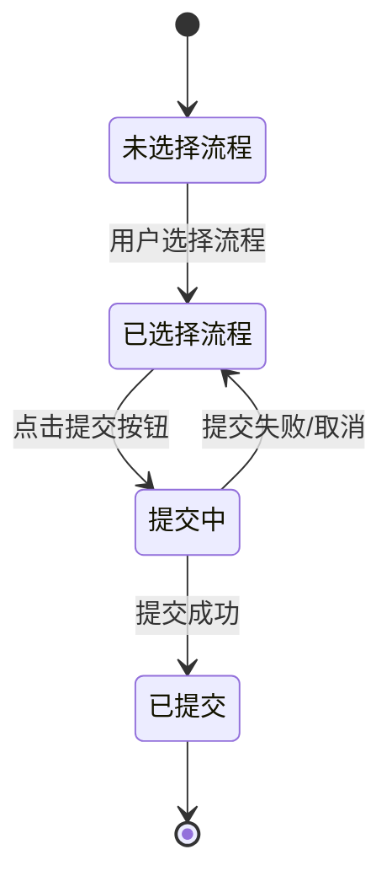

# 📘 交互与技术设计提案

## 发起审批页 (ApprovalLaunch) 与动态表单集成方案

> **版本**: v1.0  
> **提案人**: 架构师视角  
> **日期**: 2026年2月28日  
> **阶段**: Phase 0 (蓝灯阶段)

---

## 一、设计原则 (Design Principles)

### 1.1 一致性原则
- 保持与 `ApprovalDetail` 的**交互一致性**:相同比例的表单校验 → 二次确认 → Loading → 成功提示的流程
- 复用 `DynamicForm` 组件,不重复造轮子

### 1.2 用户体验原则
- **"未选择流程"的空状态**要友好,避免用户困惑
- **Loading 防抖**要合理,避免按钮频繁闪烁

### 1.3 架构原则
- 所有数据管理由 **Vue Query** 负责
- UI 状态由 **Pinia** 或 **响应式 ref** 负责
- 符合项目现有 **Composable 模式**

---

## 二、交互设计 (Interaction Design)

### 2.1 页面布局

```
┌─────────────────────────────────────────────────────────────────┐
│  发起审批                                                         │
├─────────────────────────────────────────────────────────────────┤
│  流程选择:                                                       │
│  ┌──────────────────────────────────────────────────────────┐   │
│  │ [▼ 请选择流程]  🔍 搜索...                                │   │
│  └──────────────────────────────────────────────────────────┘   │
│                                                                  │
│  ┌──────────────────────────────────────────────────────────┐   │
│  │  ❓ 未选择流程                                              │   │
│  │  请先选择一个审批流程,我们将为您展示对应的申请表单         │   │
│  │                                                            │   │
│  │  📌 已支持流程:                                             │   │
│  │  • 请假申请    • 报销申请    • 采购申请    • 出差申请      │   │
│  └──────────────────────────────────────────────────────────┘   │
│                                                                  │
│  ┌──────────────────────────────────────────────────────────┐   │
│  │  ✅ 已选流程: 请假申请                                      │   │
│  │  ┌────────────────────────────────────────────────────┐   │   │
│  │  │  <DynamicForm>                                     │   │   │
│  │  │  (渲染请假表单: 假期类型、天数、事由...)           │   │   │
│  │  └────────────────────────────────────────────────────┘   │   │
│  └──────────────────────────────────────────────────────────┘   │
│                                                                  │
│  ┌──────────────────────────────────────────────────────────┐   │
│  │  [← 返回]                     [提交申请 →]                 │   │
│  └──────────────────────────────────────────────────────────┘   │
└─────────────────────────────────────────────────────────────────┘
```

### 2.2 状态流转图



### 2.3 关键交互细节

#### 交互 1: 未选择流程的空状态

**当前问题**:
- 直接展示空白表单区域,用户不知道该做什么

**设计方案**:
```vue
<!-- Option A: 中心化空状态 (推荐) -->
<div v-if="!selectedWorkflow" class="empty-state">
  <ElEmpty description="请先选择一个审批流程">
    <ElButton @click="showWorkflowSelector">
      📋 选择流程
    </ElButton>
  </ElEmpty>
</div>

<!-- Option B: 卡片化空状态 -->
<div v-else-if="!selectedWorkflow" class="workflow-cards">
  <h3>可用流程</h3>
  <div class="card-grid">
    <WorkflowCard v-for="w in workflowList" :workflow="w" />
  </div>
</div>
```

**优点**:
- 用户知道需要先"选择流程"才能继续
- 可以并排展示多个流程卡片,提升可发现性

#### 交互 2: Loading 防抖策略

**当前问题**:
- 每次点击按钮都显示 Loading,即使网络很快,也会闪烁

**设计方案**:
```typescript
// useApprovalLaunch.ts
const { submitApproval, isLoading } = useApprovalLaunch()

// 防抖配置
const DEBOUNCE_DELAY = 300 // 300ms 延迟
const loadingTimeout = ref<ReturnType<typeof setTimeout> | null>(null)

const handleSubmit = async () => {
  // 清除之前的计时器(如果在 300ms 内完成,就不显示 Loading)
  if (loadingTimeout.value) {
    clearTimeout(loadingTimeout.value)
    loadingTimeout.value = null
  }
  
  // 设置延迟显示 Loading
  loadingTimeout.value = setTimeout(() => {
    isLoading.value = true
  }, DEBOUNCE_DELAY)
  
  try {
    await submitApproval(payload)
  } finally {
    isLoading.value = false
    if (loadingTimeout.value) {
      clearTimeout(loadingTimeout.value)
      loadingTimeout.value = null
    }
  }
}
```

**说明**:
- 如果提交在 **300ms 内完成**,不显示 Loading,用户体验更流畅
- 如果提交超过 **300ms**,显示 Loading,用户知道系统正在处理

#### 交互 3: 流程选择器

**设计方案**:
```typescript
// 方案 A: 下拉选择器 (简单场景)
<ElSelect v-model="selectedWorkflowId" placeholder="请选择流程">
  <ElOption
    v-for="workflow in workflowList"
    :key="workflow.id"
    :value="workflow.id"
    :label="workflow.name"
  />
</ElSelect>

// 方案 B: 卡片网格 (推荐,提升可发现性)
<div class="workflow-selector">
  <div 
    v-for="workflow in workflowList" 
    :key="workflow.id"
    class="workflow-card"
    :class="{ active: selectedWorkflowId === workflow.id }"
    @click="selectWorkflow(workflow)"
  >
    <h4>{{ workflow.name }}</h4>
    <p>{{ workflow.description }}</p>
    <ElTag v-if="workflow.isDefault" type="success">默认</ElTag>
  </div>
</div>
```

**推荐使用方案 B**:
- 可以展示流程描述,帮助用户理解
- 可以标记"默认流程",提升用户体验
- 视觉效果更好,符合大厂审美

---

## 三、技术架构 (Technical Architecture)

### 3.1 目录结构规划

```
apps/web/src/
├── views/approval/
│   ├── ApprovalLaunch.vue              # 页面组件
│   └── composables/
│       └── useApprovalLaunch.ts        # 核心业务逻辑
├── composables/
│   └── useWorkflowList.ts              # 新增: 流程列表数据管理
```

### 3.2 Composable 设计

#### useApprovalLaunch.ts

```typescript
export const useApprovalLaunch = () => {
  // 1. 流程列表数据 (通过 Vue Query 管理)
  const { data: workflowList, isLoading: isWorkflowLoading } = useWorkflowList()
  
  // 2. 选中的流程 ID
  const selectedWorkflowId = ref<string | null>(null)
  const selectedWorkflow = computed(() => 
    workflowList.value?.find(w => w.id === selectedWorkflowId.value)
  )
  
  // 3. 表单 Schema (根据选中的流程动态获取)
  const { data: formSchema, isLoading: isSchemaLoading } = useWorkflowSchema(
    computed(() => selectedWorkflowId.value!)
  )
  
  // 4. 表单引用
  const dynamicFormRef = ref<InstanceType<typeof DynamicForm> | null>(null)
  
  // 5. 提交逻辑
  const { isLoading: isSubmitLoading, submitApproval } = useApprovalSubmit()
  
  // 6. 提交方法
  const handleSubmit = async () => { /* ... */ }
  
  // 7. 跳转方法
  const router = useRouter()
  const handleSuccess = () => {
    router.push('/approval/mine') // 或 '/dashboard'
  }
  
  return {
    // 状态
    workflowList,
    selectedWorkflow,
    formSchema,
    dynamicFormRef,
    
    // 加载状态
    isWorkflowLoading,
    isSchemaLoading,
    isSubmitLoading,
    
    // 方法
    selectWorkflow,
    handleSubmit,
    handleSuccess,
  }
}
```

#### useWorkflowList.ts (新增)

```typescript
const useWorkflowList = () => {
  return useQuery({
    queryKey: ['workflow', 'list'],
    queryFn: async (): Promise<Workflow[]> => {
      // Mock 数据或真实 API
      return mockWorkflowList
    },
  })
}
```

#### useWorkflowSchema.ts (新增)

```typescript
const useWorkflowSchema = (workflowId: string) => {
  return useQuery({
    queryKey: ['workflow', workflowId, 'schema'],
    queryFn: async (): Promise<FormSchema> => {
      // 根据 workflowId 获取关联的表单 Schema
      const workflow = await getWorkflow(workflowId)
      return workflow.schema || mockDefaultSchema
    },
    enabled: computed(() => !!workflowId), // 只有选中流程后才加载
  })
}
```

### 3.3 数据流图

```
┌──────────────────────────────────────────────────────────────────┐
│                    ApprovalLaunch.vue                            │
│                                                                  │
│  ┌─────────────────┐    ┌─────────────────┐                     │
│  │  workflowList   │    │  selectedWork-  │                     │
│  │  (流程列表)      │    │  flow           │                     │
│  │                 │    │                 │                     │
│  │  • 请假申请      │    │  {id, name,     │                     │
│  │  • 报销申请      │    │   schemaId}     │                     │
│  │  • 采购申请      │    └─────────────────┘                     │
│  └─────────────────┘              │                               │
│         │                         │                               │
│         │                         ▼                               │
│         │              ┌─────────────────┐                       │
│         │              │  formSchema     │                       │
│         │              │  (表单结构)    │                       │
│         │              │                 │                       │
│         │              │  • fields[]     │                       │
│         │              │  • labelWidth   │                       │
│         └─────────────▶│                 │                       │
│                        └─────────────────┘                       │
│                                │                                 │
│                                ▼                                 │
│                        ┌─────────────────┐                       │
│                        │ DynamicForm     │                       │
│                        │ (渲染表单)       │                       │
│                        └─────────────────┘                       │
└──────────────────────────────────────────────────────────────────┘
```

---

## 四、核心业务逻辑 (Core Business Logic)

### 4.1 提交校验流程

```typescript
const handleSubmit = async () => {
  // Step 1: 校验表单
  const isValid = await dynamicFormRef.value?.validate()
  if (!isValid) {
    ElMessage.warning('请完善表单内容')
    return
  }

  // Step 2: 获取表单数据
  const formData = dynamicFormRef.value?.getValues()
  
  // Step 3: 二次确认
  await ElMessageBox.confirm(
    `确认提交【${selectedWorkflow.value?.name}】申请?`,
    '提交确认',
    { type: 'warning' }
  )

  // Step 4: 提交审批
  try {
    await submitApproval(
      selectedWorkflowId.value!, // workflowId
      {
        workflowId: selectedWorkflowId.value!,
        formData: formData,
        status: 'pending', // 初始状态
      }
    )

    // Step 5: 成功提示 + 跳转
    ElMessage.success('提交成功')
    handleSuccess()
  } catch (err) {
    if (err !== 'cancel') {
      ElMessage.error('提交失败,请重试')
    }
  }
}
```

### 4.2 空状态处理

```vue
<!-- 状态 1: 加载中 -->
<ElSkeleton v-if="isWorkflowLoading" />

<!-- 状态 2: 未选择流程 (默认展示) -->
<div v-else-if="!selectedWorkflow" class="workflow-selector">
  <h3>📋 请选择审批流程</h3>
  <div class="card-grid">
    <template v-for="workflow in workflowList" :key="workflow.id">
      <div 
        class="workflow-card"
        @click="selectWorkflow(workflow)"
      >
        <h4>{{ workflow.name }}</h4>
        <p>{{ workflow.description }}</p>
        <ElTag v-if="workflow.isDefault" type="success">默认</ElTag>
      </div>
    </template>
  </div>
</div>

<!-- 状态 3: 已选择流程,展示表单 -->
<div v-else>
  <DynamicForm
    v-if="formSchema"
    ref="dynamicFormRef"
    :schema="formSchema"
    :model-value="{}"
    :permissions="editablePermissions"
  />
</div>
```

---

## 五、Mock 数据设计 (Mock Data)

### 5.1 工作流列表 Mock

```typescript
// apps/web/src/mocks/workflowList.ts
export const mockWorkflowList: Workflow[] = [
  {
    id: 'wf-leave-001',
    name: '请假申请',
    description: '员工请病假、事假、年假等',
    isDefault: true,
    schemaId: 'schema-leave-001',
  },
  {
    id: 'wf-reimbursement-001',
    name: '报销申请',
    description: '差旅费、业务招待费等报销',
    isDefault: false,
    schemaId: 'schema-reimb-001',
  },
  {
    id: 'wf-purchase-001',
    name: '采购申请',
    description: '办公用品、设备采购',
    isDefault: false,
    schemaId: 'schema-purchase-001',
  },
]
```

### 5.2 表单 Schema Mock

```typescript
// apps/web/src/mocks/schemas/leave.ts
export const leaveSchema: FormSchema = {
  fields: [
    {
      key: 'leaveType',
      label: '请假类型',
      type: 'select',
      options: [
        { label: '病假', value: 'sick' },
        { label: '事假', value: 'personal' },
        { label: '年假', value: 'annual' },
      ],
      required: true,
    },
    {
      key: 'days',
      label: '请假天数',
      type: 'number',
      required: true,
      componentProps: { min: 0.5, step: 0.5 },
    },
    {
      key: 'reason',
      label: '请假事由',
      type: 'textarea',
      required: true,
      placeholder: '请详细说明请假原因',
    },
  ],
  labelWidth: '120px',
}
```

---

## 六、路由配置 (Router Configuration)

```typescript
// apps/web/src/router/routes/approval.ts
const approvalRoutes: RouteRecordRaw[] = [
  {
    path: '/approval/launch',
    name: 'ApprovalLaunch',
    component: () => import('@/views/approval/ApprovalLaunch.vue'),
    meta: {
      title: '发起审批',
      icon: 'Plus',
    },
  },
  // ... 其他路由
]
```

---

## 七、性能优化预留 (Performance Optimization)

### 7.1 表单数据缓存

```typescript
// useApprovalLaunch.ts
const formCache = ref<Record<string, Record<string, any>>>({})

const handleWorkflowChange = (workflowId: string) => {
  // 从缓存中恢复之前的填写数据
  if (formCache.value[workflowId]) {
   FormDataRef.value?.setValues(formCache.value[workflowId])
  }
}

const handleSubmitSuccess = () => {
  // 清空缓存
  if (selectedWorkflowId.value) {
    formCache.value[selectedWorkflowId.value] = {}
  }
}
```

### 7.2 防抖/节流预准备

```typescript
// 为后续的搜索功能预留防抖
import { debounce } from 'lodash-es'

const searchWorkflow = debounce((keyword: string) => {
  // 搜索逻辑
}, 300)
```

---

## 八、扩展性设计 (Extensibility)

### 8.1 支持"最近填写"快捷入口

```vue
<!-- 如果用户最近填写过某个表单,可以展示"继续填写"按钮 -->
<div v-if="recentWorkflowId" class="recent-form">
  <p>最近填写: {{ recentWorkflowName }}</p>
  <ElButton size="small" @click="continueEdit">
    🔄 继续填写
  </ElButton>
</div>
```

### 8.2 支持"模板保存"

```typescript
// 用户可以将当前填写的表单保存为模板,下次直接选择
<ElButton @click="saveAsTemplate">
  💾 保存为模板
</ElButton>
```

---

## 九、对比现有方案 (Comparison)

| 方案 | 优点 | 缺点 | 推荐度 |
|------|------|------|--------|
| **方案 A: 下拉选择器** | 实现简单,代码量少 | 无法展示流程描述,用户体验一般 | ⭐⭐⭐ |
| **方案 B: 卡片网格** | 可展示描述,视觉效果好 | 代码量稍多 | ⭐⭐⭐⭐⭐ |
| **Loading 无防抖** | 实现简单 | 用户体验差,按钮频繁闪烁 | ⭐⭐ |
| **Loading 有防抖** | 用户体验好,流畅自然 | 实现稍复杂 | ⭐⭐⭐⭐⭐ |
| **表单数据不缓存** | 实现简单 | 用户重新选择流程时需重新填写 | ⭐⭐⭐ |
| **表单数据缓存** | 用户体验好,支持"继续填写" | 需要管理缓存清理逻辑 | ⭐⭐⭐⭐⭐ |

**最终选择**: **方案 B + 有防抖 Loading + 表单缓存**

---

## 十、实施优先级 (Implementation Priority)

### Phase 0 (本次蓝灯阶段)
- [x] 输出本设计文档
- [ ] `useWorkflowList.ts` (流程列表 Composable)
- [ ] `useWorkflowSchema.ts` (表单 Schema Composable)
- [ ] `useApprovalLaunch.ts` (主 Composable)
- [ ] `ApprovalLaunch.vue` (页面组件)

### Phase 1 (后续迭代)
- [ ] "最近填写"快捷入口
- [ ] "模板保存"功能
- [ ] 表单数据持久化 (localStorage)
- [ ] 表单填写进度自动保存 (自动草稿)

---

## 十一、风险与应对 (Risk Mitigation)

| 风险 | 影响 | 应对措施 |
|------|------|----------|
| 流程列表加载慢 | 用户体验差 | 显示 Skeleton + 空状态提示 |
| 表单 Schema 获取失败 | 表单无法渲染 | 显示错误提示 + 重试按钮 |
| 提交失败 | 数据不一致 | 显示错误消息 + 允许用户重试 |
| 多个表单同时打开 | 内存占用高 | 限制同时打开数量 + 自动清理 |

---

## 十二、总结 (Summary)

### 核心设计亮点

1. **空状态友好** - 卡片网格展示流程,用户可以直观选择
2. **Loading 防抖** - 300ms 延迟,避免闪烁
3. **数据缓存** - 表单数据缓存,支持"继续填写"
4. **架构一致** - 与 `ApprovalDetail` 保持一致的交互模式

### 技术要点

- ✅ Vue Query 管理所有数据状态
- ✅ Composable 模式分离业务逻辑
- ✅ 复用 `DynamicForm` 组件
- ✅ 符合项目现有架构风格

---

## 📌 下一步行动项

1. **代码实现**
   - 创建 `useWorkflowList.ts`
   - 创建 `useWorkflowSchema.ts`
   - 创建 `useApprovalLaunch.ts`
   - 创建 `ApprovalLaunch.vue`

2. **Mock 数据**
   - 补充 `mockWorkflowList`
   - 补充各个流程的 `FormSchema`

3. **路由与菜单**
   - 配置 `/approval/launch` 路由
   - 在侧边菜单中添加入口

4. **测试**
   - 单元测试 (Vitest)
   - E2E 测试 (Playwright)

---

**批准人**: ___________________  
**日期**: 2026年2月28日

---

✅ **设计文档完成!进入编码阶段 ( Phase 1 )**
